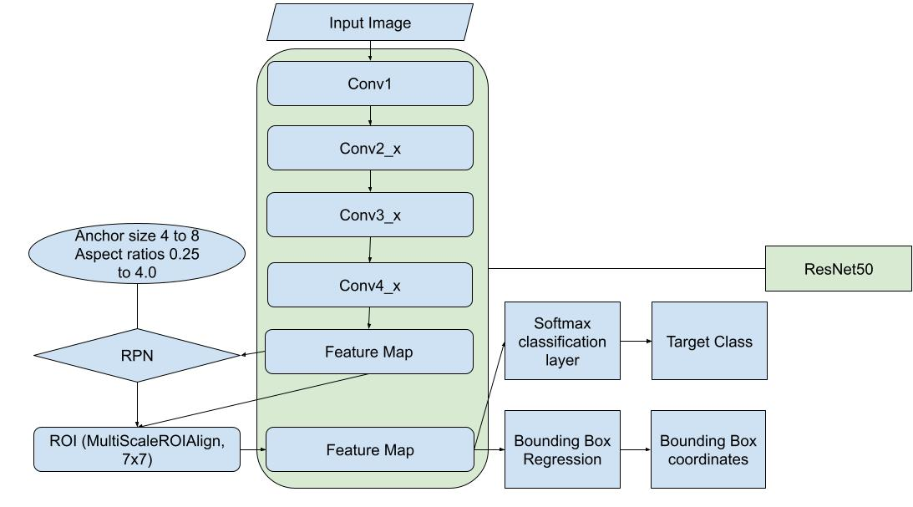

# Question 2

## Architecture Diagram

## Architecture Description

- Input Layer
    - Variable image size input
- ResNet50 Backbone
    - Pretrained on ImageNet (IMAGENET1K_V1)
    - Removed last two layers to maintain convolutional features
    - Feature extraction from the input image
    - Output: 2048 channels
- Region Proposal Network (RPN)
    - Anchor Generator:
        - Sizes: 4 to 256
        - Ratios: 0.25 to 4.0
    - Candidate bounding box generation
    - Non Maximum Suppresion used to remove redundant bounding box proposals
- MultiScale RoI Align
    - Feature map extraction for region proposals
    - Consistent size maintained: 7x7
- RoI Head
    - Fully Connected layers for Object Classification and Bounding Box Regression
- Final Prediction Output
    - Bounding Box
    - Class score/confidence

## Training and Detection Analysis

- Anchor box configuration
    - Aspect ratio range of 0.5 to 4 allows for vertically elongated to horizontally elongated boxes - accounts for single fruit and overlapping fruit clusters
    - Size range of 4 to 256 allows for fruit detection of wide range of sizes and even clusters
- Role of NMS
    - A particular detected fruit could have multiple bounding boxes
    - NMS chooses the box which is the most accurate of them
    - Removes redundant and unnecessary duplicate predictions
- Strategies for handling overlapping fruits
    - The model uses NMS to filter out redundant bounding, retaining only the most confident and accurate ones
    - The mask to bounding box conversion was done using label and regionprops from skimage.measure which looks for connected set of pixels of same color; masks for overlapping fruits are treated like a single component and get a single bounding box together
- Impact of IoU threshold
    - Overall:
        - The mAP goes down as the threshold increases
    - Single Image:
        - There is an increase in the false positive and false negative
        - The precision-recall curve visibly changes from above the line (0,1)-(1,0) to below it
        - As threshold increases, the number of mismatches increases as the IoU is unable to meet the threshold, which explains the increase in false negatives
- Augmentation techniques
    - No augmentation: mAP@0.6 is 0.4589
    - Augmentation (Color Jitter): mAP@0.6 is 0.4725
    - Adding the color jitter improves the performance by about 1.5%
    - This augmentation is used to help model adjust to variations in brightness, contrast, saturation, etc
- Impact of Image Resolution
    - The ResNet50 backbone and MultiScale feature map allows processing of different resolutions
    - MultiScaleRoIAlign normalizes features into 7x7 feature maps
    - Anchor generator of different sizes tries to account for boxes of all sizes
    - These are some ways to make the model less affected by image resolution

## Analysis and Evaluation
- Impact of Occlusion
- Color variation and Light condition
    - This impact is taken care of by training the model on color jitter augmented dataset, improving robustness against these variations
- Densely Clustered vs Isolated fruits
    - Clustering impacts performance as individual fruits don't get separate bounding boxes and the size of the bounding box increase
    - NMS tries to handle these multiple predictions but false negatives do tend to increase
- Fruits at different scales
    - Performs well across scales but may miss out on smaller sizes due to feature maps having a lower resolution and missing them out

## General Analysis
- External image
    - The external image used is that of an orange tree
    - The dense presence of leaves leads to occlusion, the image has high brightness
    - Despite this the model performs well and identifies most of the fruits
- Modification for Improved Detection
    - Training on dataset with more fruit types - generalization
    - Fine tuned classification layers to handle the differences that above dataset will bring about between fruit types
    - Improved data augmentation techniques for environment variables - sunlight, shadow, contrast in the image, etc
    - Use of multi scale feature maps to handle different ripeness stages
    - Augment training data with images from different stages to improve recognition

## Prompts
https://claude.ai/share/8cf98a9d-ed41-43b3-be99-d117f97f0877
https://claude.ai/share/7291555f-e1bf-46d7-bf7b-1a4bc59eb072
https://chatgpt.com/share/67d42bfa-2f3c-800a-96f5-65a29c7bcc92