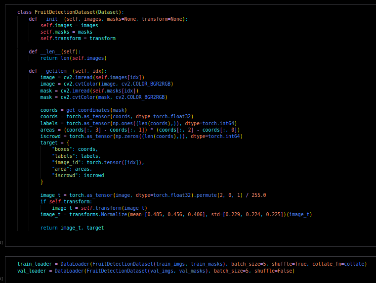
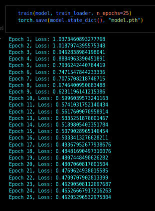
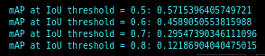

# Q2 Experiments

## No augmentation

Image 0, IoU threshold =  0.5
False positive:  22.0
False negative:  2.0
mAP at IoU threshold = 0.5: 0.5715396405749721

Image 0, IoU threshold =  0.6
False positive:  26.0
False negative:  6.0
mAP at IoU threshold = 0.6: 0.4589050553815988

Image 0, IoU threshold =  0.7
False positive:  29.0
False negative:  9.0
mAP at IoU threshold = 0.7: 0.29547390346111096

Image 0, IoU threshold =  0.8
False positive:  35.0
False negative:  15.0
mAP at IoU threshold = 0.8: 0.12186904040475015

## Color Jitter + Double Dataset Size

Image 0, IoU threshold =  0.5
False positive:  12.0
False negative:  4.0
mAP at IoU threshold = 0.5: 0.5858453035536932

Image 0, IoU threshold =  0.6
False positive:  13.0
False negative:  5.0
mAP at IoU threshold = 0.6: 0.4725093467002114

Image 0, IoU threshold =  0.7
False positive:  19.0
False negative:  11.0
mAP at IoU threshold = 0.7: 0.3080364071755885

Image 0, IoU threshold =  0.8
False positive:  26.0
False negative:  18.0
mAP at IoU threshold = 0.8: 0.14703638389824894
